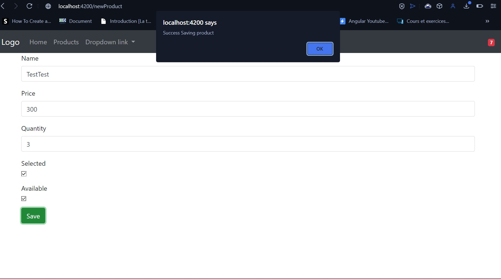
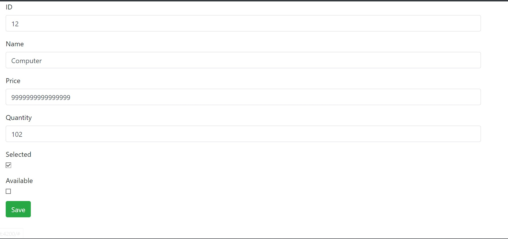
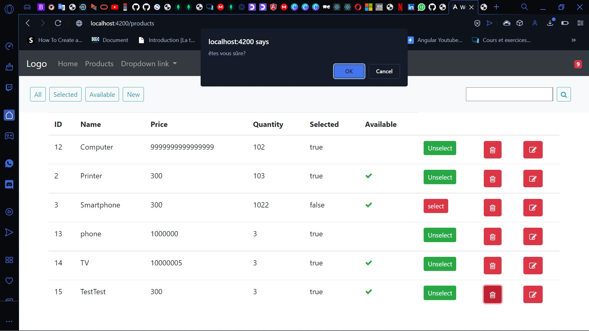
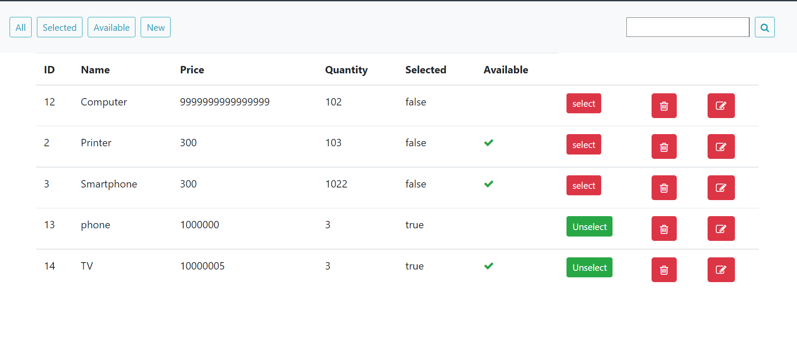
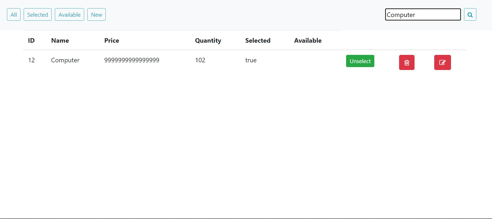
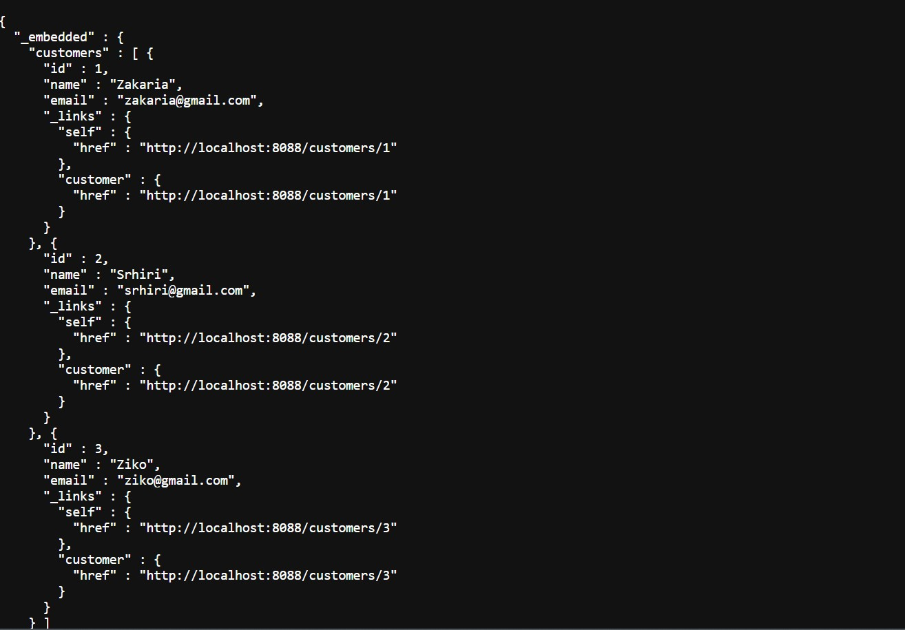
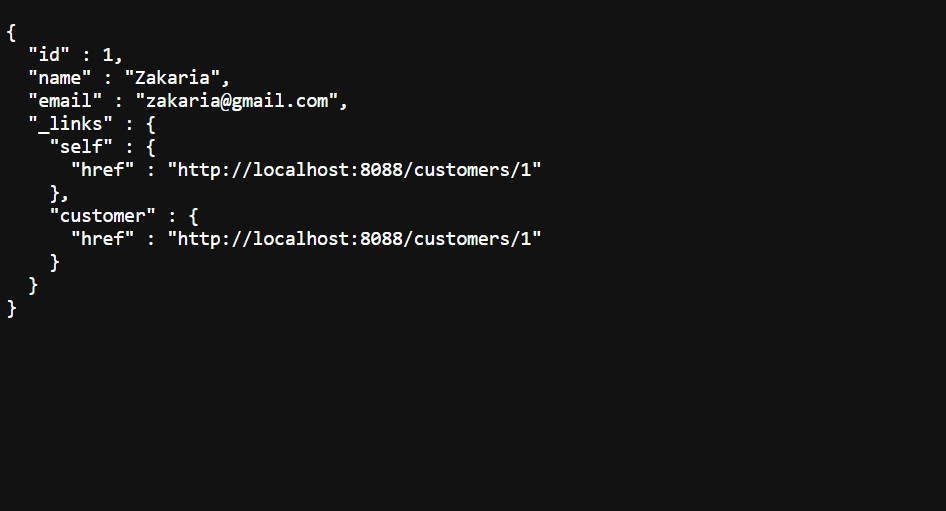
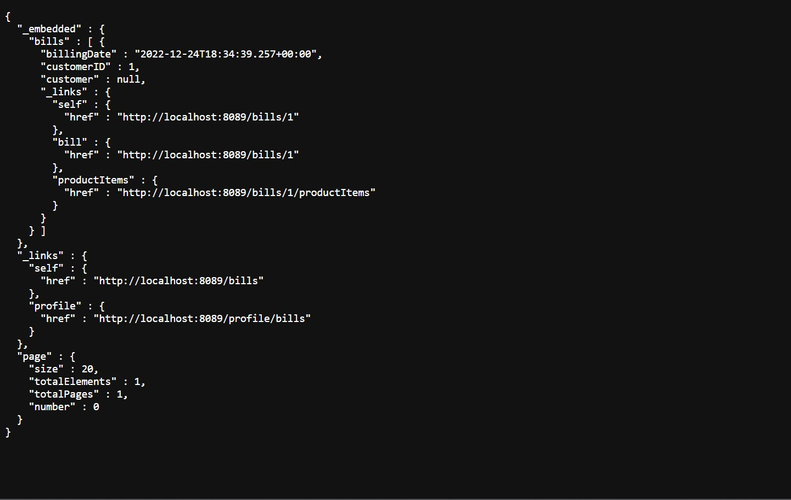
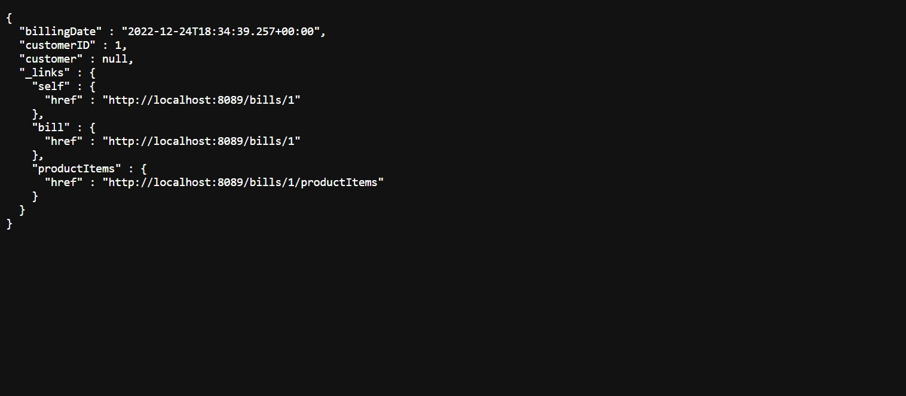
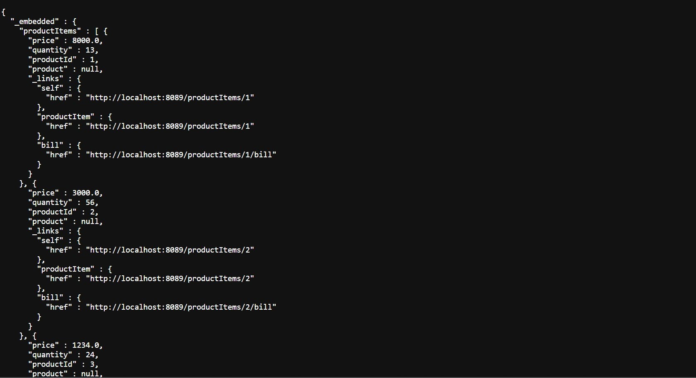

# Controle_Service
<h1><i>1-Objectif :</i><h1>
<h3>Créer une application basée sur une architecture micro-service qui permet de gérer les factures contenant des produits et appartenant à un client.</h3>
<ol>
  <li>Micro-service customer-service qui permet de gérer les client</li>
  <li>Micro-service inventory-service qui permet de gérer les produits</li>
  <li>Gateway Spring cloud Gateway avec une Configuration statique du système de routage</li>
  <li>Annuaire Eureka Discrovery Service</li>
  <li>Configuration dynamique des routes de la gateway</li>
  <li>Service de facturation Billing-Service en utilisant Open Feign</li>
  <li>Client Web Angular (Clients, Produits, Factures)</li>
  <li>Déployer le serveur keycloak :</li>
  <dl>
  <dt>- Créer un Realm</dt>
  <dt>- Créer un client à sécuriser</dt>
  <dt>- Créer des utilisateurs</dt>
  <dt>- Créer des rôles</dt>
  <dt>- Affecter les rôles aux utilisateurs</dt>
  <dt>- Tester les différents modes d'authentification avec Postman en montrant les contenus de Access-Token, Refresh Token</dt>
  </dl>
  <li>Sécuriser les micro-services et le frontend angular en déployant les adaptateurs Keycloak</li>
</ol>
<h1><i>2-Architecture de l'activité pratique :</i><h1>

<h1><i>3-Manifestations :</i><h1>
<h3>Le projet est une gestion complète, ce qui signifie que le projet est un outil de gestion de produit, de client et de facturation.</h3>
<h2>La gestion des produits </h2>
<table>
<tr>
<td>L'ajout d'un produit</td>
<td></td>
</tr>
<tr>
<td>La modification d'un produit</td>
<td></td>
</tr>
<tr>
<td>La suppression d'un produit</td>
<td></td>
</tr>
<tr>
<td>L'affichage d'un produit</td>
<td></td>
</tr>
<tr>
<td>La recherche des produits</td>
<td></td>
</tr>
</table>
<h2>La gestion des clients </h2>
<table>
<tr>
<td>L'affichage des clients</td>
<td></td>
</tr>
<tr>
<td>L'affichage d'un seul client</td>
<td></td>
</tr>
</table>
<h2>La gestion des facturations</h2>
<table>
<tr>
<td>L'affichage des factures</td>
<td></td>
</tr>
<tr>
<td>L'affichage d'un seule facture</td>
<td></td>
</tr>
<tr>
<td>L'affichage des produits d'une seule facture</td>
<td></td>
</tr>
</table>
